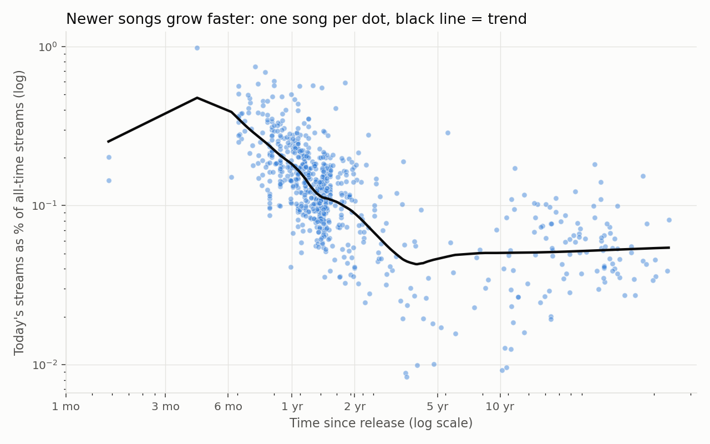
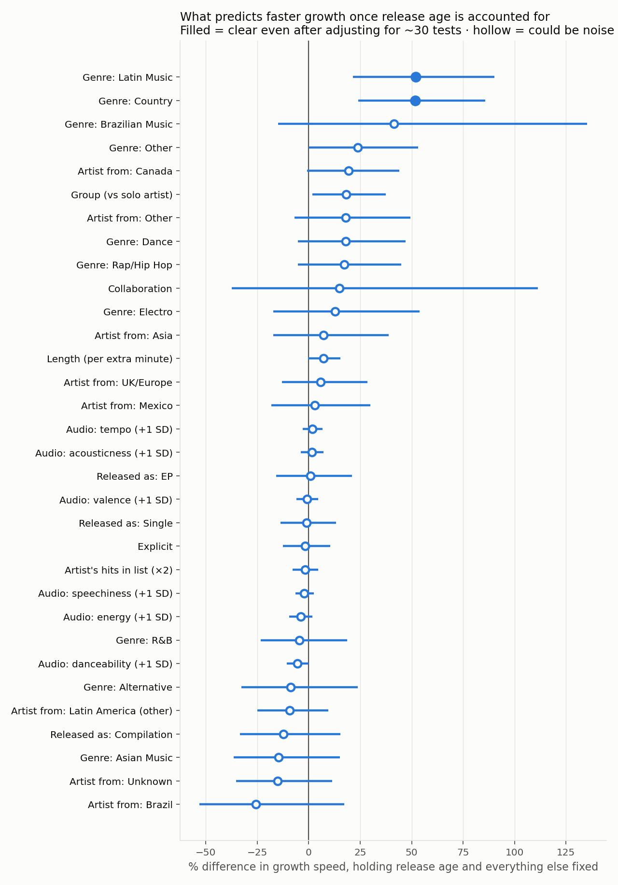

# What makes a song rise?

Enriches Spotify's 730 most-streamed songs (snapshot July 2026) with metadata and audio features, then tests what predicts how fast a song is still gaining streams once release age is accounted for.

## Findings

- Release age explains about half the variation in growth (out-of-sample R² 0.52 on held-out artists).
- Beyond age, only country and Latin music clearly stand out: each grows about 52% faster than pop of the same age.
- Audio features, explicit content, collaborations and release format show no reliable effect.




Full tables in [reports/results.md](reports/results.md).

## Run

```bash
python3 enrich.py    # ~15 min first time (MusicBrainz is rate-limited to 1 req/s); seconds after, from cache/
python3 analyze.py   # model, charts, and reports/dashboard.html
```

Needs `pandas`, `requests`, `statsmodels`, `scikit-learn`, `matplotlib`. No API keys.

## Data sources

| Source | Adds |
|---|---|
| Deezer | release date, genre, label, single/album/EP, length, explicit, ISRC |
| MusicBrainz | original release date (replaces reissue dates), artist country, solo/group |
| ReccoBeats | audio features (danceability, energy, valence, tempo, ...) by ISRC |

## Outputs

- `data/spotify_2025_enriched.csv`: one row per song, 40+ columns
- `reports/results.md`: model comparison and effect tables
- `reports/*.png`: static charts
- Generated locally, not committed: `reports/dashboard.html` (interactive dashboard built from `dashboard_template.html`) and `reports/songs_with_residuals.csv` (each song's growth vs the expected pace for its age)

## Method notes

- Growth = daily streams ÷ all-time streams, modelled on a log scale.
- Release age enters as a spline (growth falls for ~3 years, then flattens).
- Standard errors are clustered by artist; p-values are Holm-adjusted for testing ~30 factors.
- Out-of-sample R² holds out whole artists at a time.
- Release dates: the earlier of Deezer and MusicBrainz, with an ISRC-year check to reject same-title mismatches. Four verified reissues are listed in `VERIFIED_REISSUES` in `enrich.py`.
